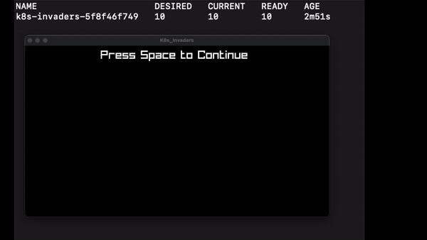

# K8s_Invaders

## How to run
!Warning: This by default will you the current context in your kubeconfig. 

```bash
git clone https://github.com/Gl-Game-Dev/K8s_Invaders
cd K8s_Invaders
go get
go run main.go
```



